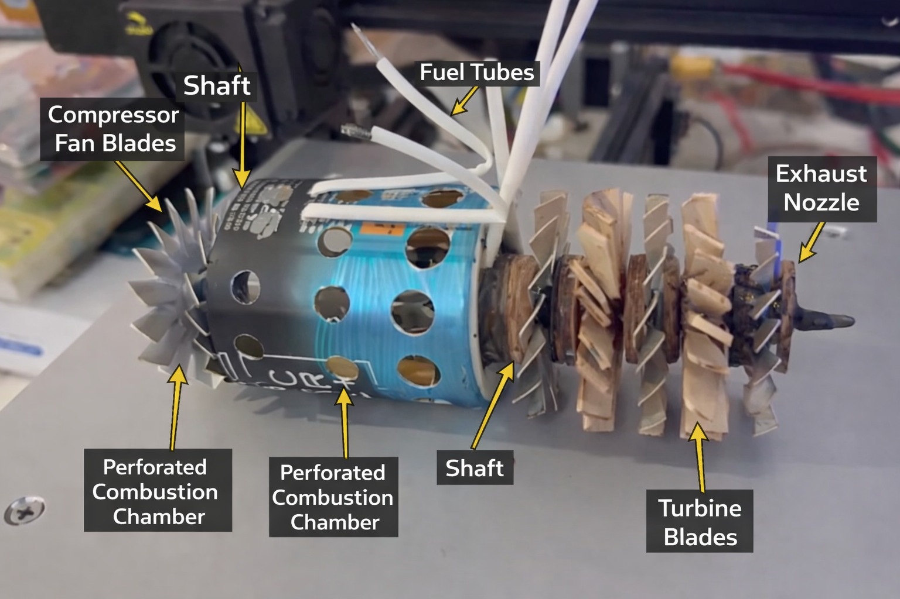
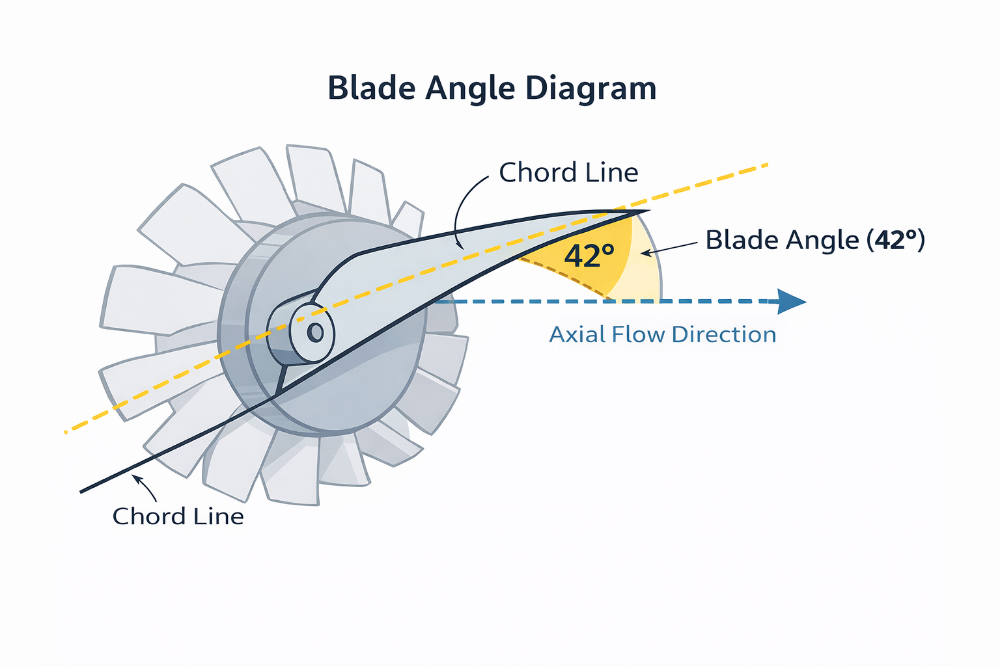
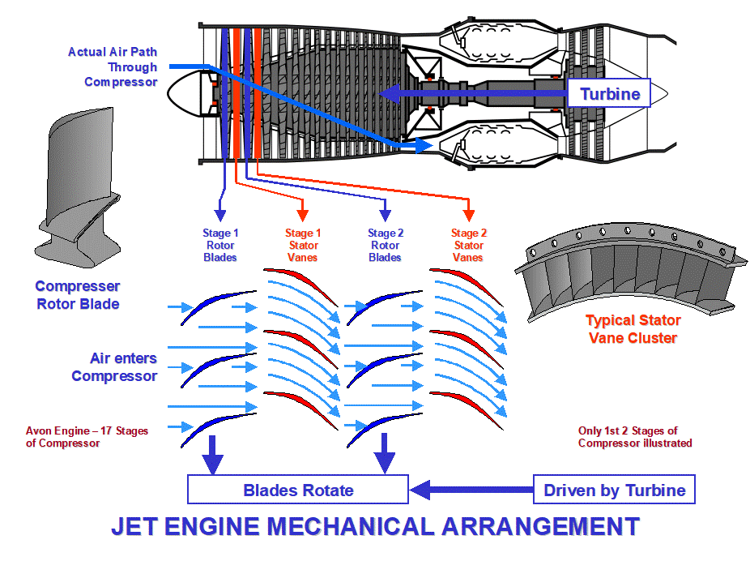
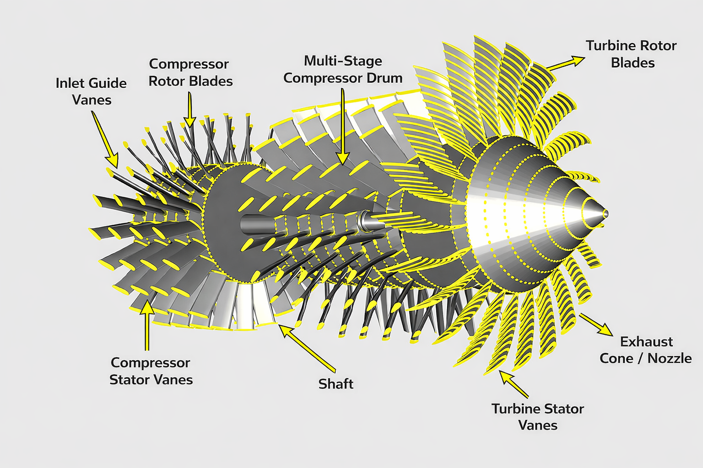
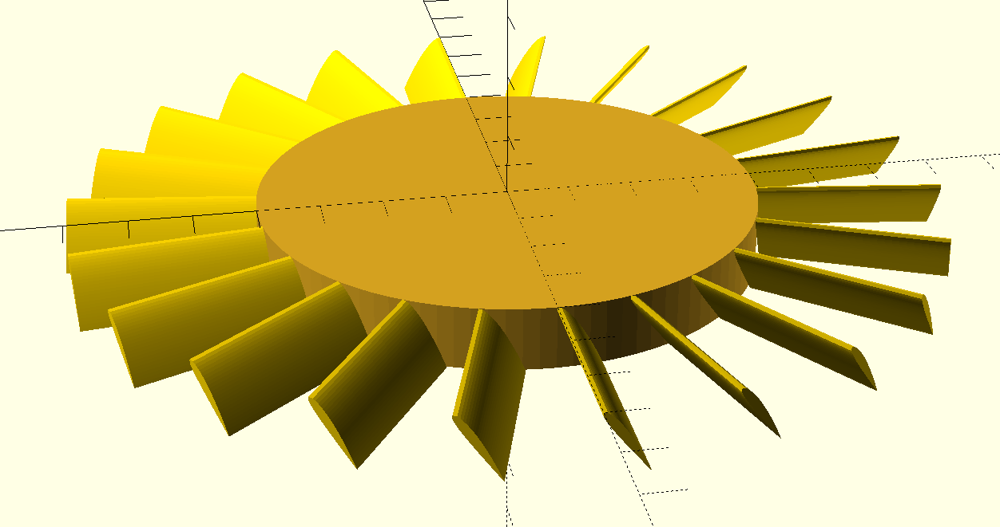
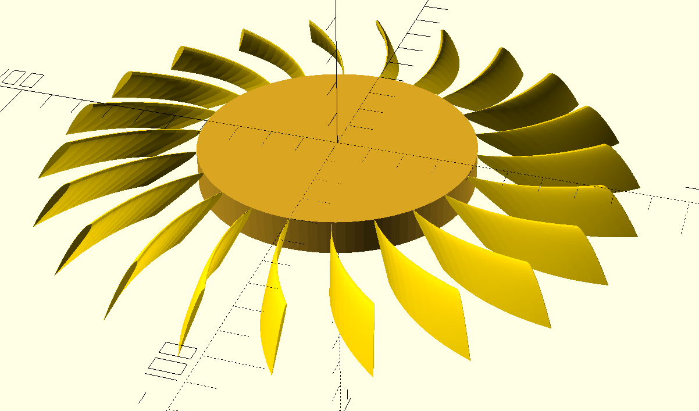
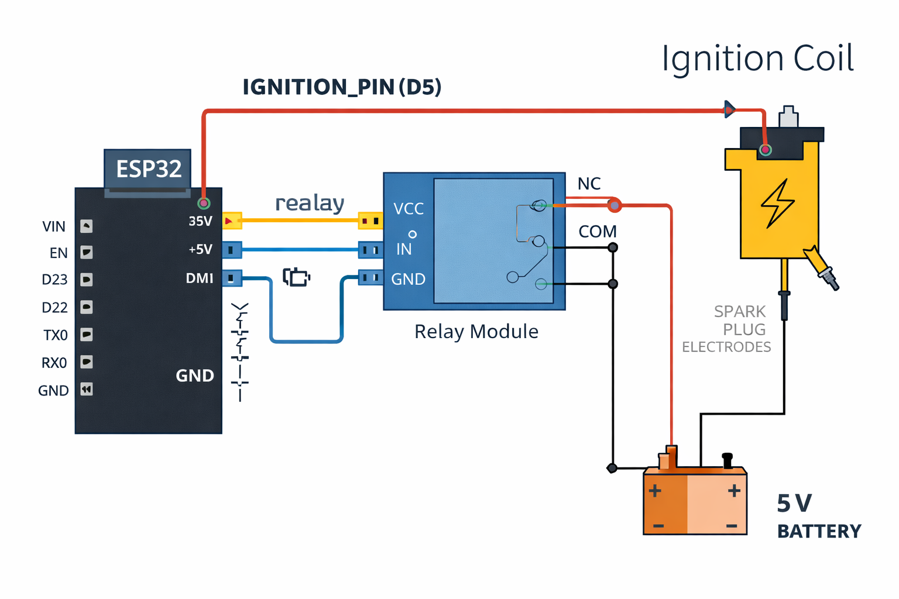
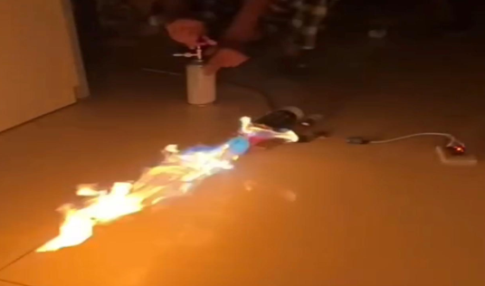
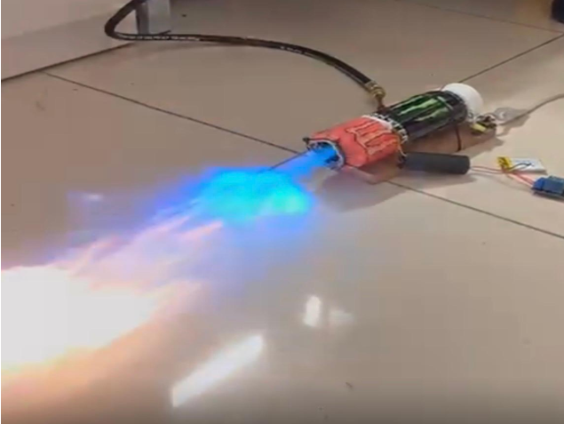

# 🔥 Turbojet Engine Prototype

<p align="center">
  
</p>

<p align="center">
  <strong>Design • Fabrication • Assembly • Testing</strong>
</p>

<p align="center">
  A small-scale turbojet engine prototype developed as an engineering project.
</p>

---

## 📌 Overview

This project focuses on the **design, fabrication, assembly, and testing of a small-scale turbojet engine prototype**.

The objective was to explore the fundamental principles behind turbojet propulsion while gaining practical experience in:

- Mechanical design
- CAD modelling
- Turbomachinery
- Blade geometry
- Combustion systems
- Shaft and rotor assembly
- Fabrication
- Ignition systems
- Experimental testing

The project combines **mechanical engineering, thermodynamics, fluid mechanics, fabrication, and electronics** into a single engineering prototype.

---

## ⚙️ Working Principle

A turbojet operates by continuously compressing incoming air, adding heat through combustion, and expanding the resulting high-energy gases through a turbine and exhaust nozzle.

The basic process is:

```text
              AIR INLET
                  │
                  ▼
        ┌──────────────────┐
        │    COMPRESSOR    │
        │   Rotor Blades   │
        └────────┬─────────┘
                 │
                 │ Compressed Air
                 ▼
        ┌──────────────────┐
        │    COMBUSTION    │
        │      CHAMBER     │
        │                  │
        │   Fuel + Air     │
        │       +          │
        │    Ignition      │
        └────────┬─────────┘
                 │
                 │ Hot Gas
                 ▼
        ┌──────────────────┐
        │     TURBINE      │
        │   Rotor Blades   │
        └────────┬─────────┘
                 │
                 │ High Velocity Gas
                 ▼
        ┌──────────────────┐
        │ EXHAUST NOZZLE   │
        └────────┬─────────┘
                 │
                 ▼
              EXHAUST
```

The turbine extracts energy from the hot gas flow and transfers mechanical power through the shaft to drive the compressor.

---

## 🧩 Major Components

The prototype consists of the following major sections:

- **Compressor fan blades**
- **Compressor shaft**
- **Perforated combustion chamber**
- **Fuel tubes**
- **Turbine blades**
- **Turbine shaft**
- **Exhaust nozzle**
- **Ignition system**

<p align="center">
  
</p>

<p align="center">
  <em>Annotated prototype showing the major components.</em>
</p>

---

# 📐 Blade Design

Blade geometry is an important part of turbomachinery design because the blade angle influences the interaction between the rotating blade and the airflow.

The prototype uses a **42° blade angle** for the designed blade geometry.

<p align="center">
  
</p>

<p align="center">
  <em>Blade angle diagram showing the 42° blade angle and axial flow direction.</em>
</p>

### Design Parameters

| Parameter | Value |
|---|---:|
| Blade angle | 42° |
| Turbine vane blades | 18 |
| Shaft material | Aluminium |
| Combustion chamber | Perforated aluminium sheet |
| Base material | Wood |
| Shaft support | Stainless-steel rod |

---

# 🌀 Compressor & Turbine Arrangement

The compressor and turbine are mechanically connected through a common shaft.

The compressor is responsible for increasing the pressure of the incoming air, while the turbine extracts energy from the hot combustion gases.

<p align="center">
  
</p>

<p align="center">
  <em>CAD representation of compressor and turbine arrangement.</em>
</p>

### Reference Mechanical Arrangement

<p align="center">
  
</p>

<p align="center">
  <em>Reference diagram illustrating the mechanical arrangement and airflow through a jet engine.</em>
</p>

> **Note:** The above arrangement diagram is included as a reference for understanding the general architecture of a turbojet engine.

---

# 🧱 CAD Development

CAD modelling was used to develop and visualize the rotating components before fabrication.

Different blade geometries and rotor configurations were explored during the design process.

## Vanes / Blade Model

<p align="center">
  
</p>

<p align="center">
  <em>CAD model of the turbine Vanes arrangement.</em>
</p>

## Curved Turbine Blade Geometry

<p align="center">
  
</p>

<p align="center">
  <em>CAD development of curved turbine blade geometry.</em>
</p>

The CAD models were used to study:

- Blade arrangement
- Blade geometry
- Rotor configuration
- Shaft integration
- Overall component proportions

---

# 🔥 Ignition System

An electronically controlled ignition system was developed for the combustion chamber.

<p align="center">
  
</p>

<p align="center">
  <em>ESP32-based ignition control system.</em>
</p>

The ignition system consists of:

- ESP32
- Relay module
- Ignition coil
- Spark plug
- Battery
- Electrical wiring

The ESP32 provides the control signal to the relay, which switches the ignition circuit.

---

# 🏭 Fabrication & Assembly

The prototype was fabricated using a combination of sheet-metal work, mechanical components, and manually assembled parts.

### Materials Used

- Thin aluminium sheets
- Aluminium shaft
- Stainless-steel rod
- Wooden base
- Fabricated compressor blades
- Fabricated turbine blades

### Fabrication Process

```text
CAD Design
    │
    ▼
Component Dimensions
    │
    ▼
Material Preparation
    │
    ▼
Blade Fabrication
    │
    ▼
Combustion Chamber Fabrication
    │
    ▼
Shaft & Rotor Assembly
    │
    ▼
Ignition Integration
    │
    ▼
Final Assembly
```

The combustion chamber incorporates perforations to facilitate airflow through the chamber.

---

# 🧪 Testing

After fabrication and assembly, the prototype was experimentally tested to evaluate ignition and combustion behaviour.

## Initial Test

<p align="center">
  
</p>

<p align="center">
  <em>Initial prototype test.</em>
</p>

## Combustion Test

<p align="center">
  
</p>

<p align="center">
  <em>Observed combustion and exhaust during testing.</em>
</p>

The tests demonstrated successful ignition and visible high-temperature exhaust flow from the prototype.

> ⚠️ **Safety:** This project involves combustion, high-temperature gases, fuel, ignition systems, and potentially high-speed rotating components. Operation requires appropriate safety procedures, protective equipment, ventilation, fire-safety measures, and suitable engineering supervision.

---

# 📊 Project Development

The overall development process followed this workflow:

```text
┌────────────────────────┐
│        CONCEPT         │
└────────────┬───────────┘
             ↓
┌────────────────────────┐
│     INITIAL DESIGN     │
└────────────┬───────────┘
             ↓
┌────────────────────────┐
│      CAD MODELLING     │
└────────────┬───────────┘
             ↓
┌────────────────────────┐
│     BLADE GEOMETRY     │
└────────────┬───────────┘
             ↓
┌────────────────────────┐
│       FABRICATION      │
└────────────┬───────────┘
             ↓
┌────────────────────────┐
│        ASSEMBLY        │
└────────────┬───────────┘
             ↓
┌────────────────────────┐
│  IGNITION INTEGRATION  │
└────────────┬───────────┘
             ↓
┌────────────────────────┐
│        TESTING         │
└────────────┬───────────┘
             ↓
┌────────────────────────┐
│ EVALUATION & ITERATION │
└────────────────────────┘
```

---

# 🛠️ Software & Tools

## CAD & Engineering

- Fusion 360
- SolidWorks
- FreeCAD
- Simscale

## Electronics & Control

- ESP32
- Relay Module
- Ignition Coil

## Manufacturing

- Sheet-metal fabrication
- Machining
- Manual assembly
- Prototyping

---

# 📚 Engineering Concepts

This project involved practical application of:

- Fluid Mechanics
- Blade Geometry
- Combustion
- Mechanical Design
- CAD Modelling
- Manufacturing
- Experimental Testing

---

# 🚀 Future Improvements

Future iterations of the prototype could focus on:

- Improved compressor blade geometry
- Optimized turbine blade profiles
- Improved rotor balancing
- Improved combustion chamber design
- Temperature measurement
- RPM measurement
- Pressure measurement
- Thrust measurement
- CFD analysis
- Structural analysis
- Thermal analysis
- Improved instrumentation
- Improved overall efficiency

---

# 🎯 Project Goals

The main goals of this project were:

1. Understand the operating principles of turbojet engines.
2. Design and model major engine components.
3. Explore turbine and compressor blade geometry.
4. Fabricate a physical prototype.
5. Integrate an electronic ignition system.
6. Assemble the complete prototype.
7. Conduct experimental testing.
8. Identify areas for future optimization.

---

# 📸 Project Gallery

## Prototype

<p align="center">
  
</p>

## Blade Design

<p align="center">
  
</p>

## CAD Models

<p align="center">
  
</p>

<p align="center">
  
</p>
<p align="center">
  
</p>

## Ignition System

<p align="center">
  
</p>

## Testing

<p align="center">
  
</p>

<p align="center">
  
</p>

---

# 🧠 Key Learning Outcomes

Through this project, practical experience was gained in:

- Mechanical system design
- CAD modelling
- Turbomachinery concepts
- Blade design
- Fabrication techniques
- Shaft and rotor assembly
- Electrical integration
- Ignition control
- Experimental testing
- Engineering iteration
- Technical documentation

---

# 👨‍💻 Author

## Priyansh Sharma

**Mechatronics Engineering Student**

Robotics • Artificial Intelligence • Embedded Systems • Mechanical Design

---

# ⚠️ Safety Disclaimer

This repository documents an educational engineering prototype involving combustion, fuel, ignition, high-temperature gases, and rotating components.

Such systems can present significant risks including fire, burns, mechanical failure, and high-speed rotating machinery hazards.

The prototype should **not** be considered a certified aircraft propulsion system or production-ready engine.

Any physical testing should be conducted using appropriate engineering controls, protective equipment, fire-safety measures, adequate ventilation, and suitable supervision.

---

# 📜 License

This project is intended primarily for educational and engineering documentation purposes.

If design files are later released publicly, an appropriate open-source hardware license can be selected for the CAD and hardware designs.
